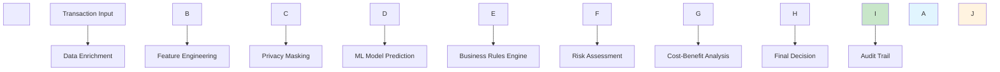
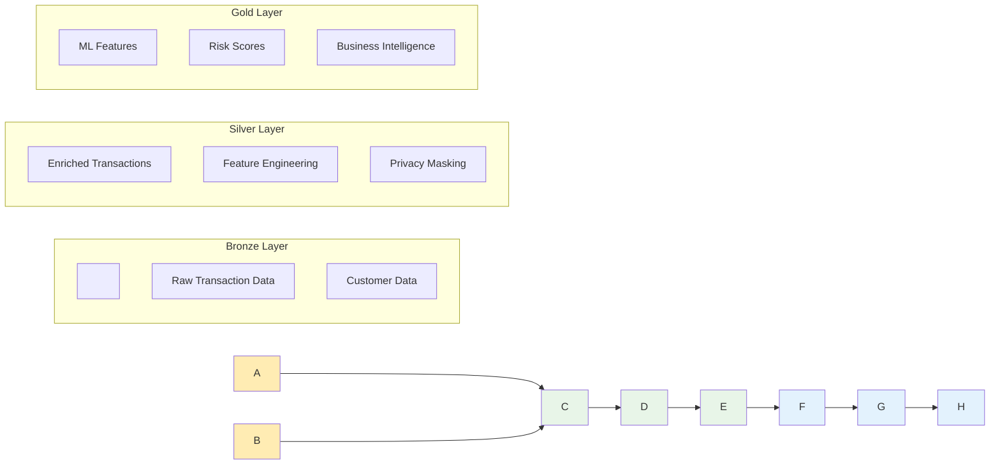
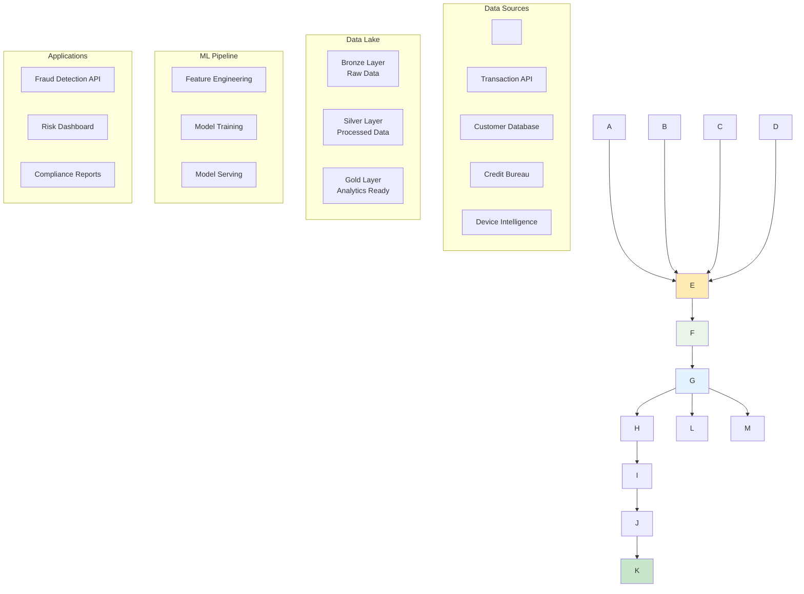

\# 🛡️ Enterprise Fraud Detection Platform


A production-ready fraud detection system that analyzes 50+ real-world risk factors to identify fraudulent transactions with 79.86% AUC performance.


\## 📋 Project Description


This enterprise-grade fraud detection platform implements a comprehensive risk assessment system that processes financial transactions in real-time. The system combines traditional fraud indicators with advanced behavioral analytics, credit scoring, and regulatory compliance checks to deliver actionable business decisions.


\*\*Key Features:\*\*

\- Real-time fraud detection with sub-second response times

\- 50+ fraud risk factors including credit scores, SSN analysis, and behavioral patterns

\- Enterprise data lake architecture with Bronze → Silver → Gold medallion pattern

\- GDPR/CCPA/PCI DSS compliant privacy masking

\- Cost-benefit analysis with ROI calculations

\- Production-ready REST APIs


\## 🔧 Requirements


\### System Requirements

\- Python 3.8+

\- 8GB+ RAM

\- 10GB+ storage space


\### Dependencies

```bash

pip install -r requirements.txt

```


\*\*Core Libraries:\*\*

\- `pandas` - Data manipulation and analysis

\- `scikit-learn` - Machine learning models

\- `flask` - REST API framework

\- `numpy` - Numerical computing

\- `faker` - Synthetic data generation

\- `hashlib` - Privacy masking utilities


\## 🔄 Workflow





\### Data Processing Pipeline





\## 🎯 Use Cases


\### Primary Use Cases

\- \*\*Real-time Transaction Monitoring\*\* - Instant fraud detection for online payments

\- \*\*Risk Assessment\*\* - Comprehensive evaluation of customer creditworthiness

\- \*\*Regulatory Compliance\*\* - AML/KYC screening and sanctions checking

\- \*\*Business Intelligence\*\* - ROI analysis and fraud prevention optimization


\### Industry Applications

\- \*\*Banking \& Finance\*\* - Credit card fraud detection

\- \*\*E-commerce\*\* - Payment fraud prevention

\- \*\*Insurance\*\* - Claims fraud identification

\- \*\*Fintech\*\* - Digital wallet security


\### Decision Matrix

| Risk Level | Fraud Probability | Business Action | Use Case |

|------------|------------------|----------------|----------|

| LOW | 0-15% | APPROVE | Normal transactions |

| MEDIUM | 15-45% | REVIEW | Manual verification |

| HIGH | 45-75% | DECLINE | Automatic rejection |

| CRITICAL | 75%+ | ESCALATE | Investigation required |


\## 📊 Data Model Diagram


```mermaid

erDiagram

&nbsp;   CUSTOMERS {

&nbsp;       string customer\_id PK

&nbsp;       string ssn

&nbsp;       float fico\_score

&nbsp;       float cibil\_score

&nbsp;       float annual\_income

&nbsp;       string employment\_status

&nbsp;       int account\_age\_days

&nbsp;       float debt\_to\_income\_ratio

&nbsp;       float credit\_utilization

&nbsp;       int overdraft\_count

&nbsp;       timestamp created\_at

&nbsp;   }

&nbsp;   

&nbsp;   TRANSACTIONS {

&nbsp;       string transaction\_id PK

&nbsp;       string customer\_id FK

&nbsp;       float amount

&nbsp;       string channel

&nbsp;       string merchant

&nbsp;       timestamp transaction\_time

&nbsp;       string ip\_address

&nbsp;       string device\_id

&nbsp;       float chargeback\_ratio

&nbsp;       float return\_rate

&nbsp;       string location

&nbsp;       timestamp created\_at

&nbsp;   }

&nbsp;   

&nbsp;   RISK\_ASSESSMENTS {

&nbsp;       string assessment\_id PK

&nbsp;       string transaction\_id FK

&nbsp;       float fraud\_probability

&nbsp;       string risk\_level

&nbsp;       string business\_action

&nbsp;       float confidence\_score

&nbsp;       json contributing\_factors

&nbsp;       float expected\_cost

&nbsp;       float fraud\_prevented

&nbsp;       float roi

&nbsp;       timestamp created\_at

&nbsp;   }

&nbsp;   

&nbsp;   FEATURE\_STORE {

&nbsp;       string feature\_id PK

&nbsp;       string transaction\_id FK

&nbsp;       float credit\_risk

&nbsp;       float amount\_risk

&nbsp;       float velocity\_risk

&nbsp;       float account\_age\_risk

&nbsp;       float identity\_risk

&nbsp;       float device\_risk

&nbsp;       float behavioral\_risk

&nbsp;       float regulatory\_risk

&nbsp;       json feature\_vector

&nbsp;       timestamp created\_at

&nbsp;   }

&nbsp;   

&nbsp;   AUDIT\_TRAIL {

&nbsp;       string audit\_id PK

&nbsp;       string transaction\_id FK

&nbsp;       string action\_type

&nbsp;       string user\_id

&nbsp;       json before\_state

&nbsp;       json after\_state

&nbsp;       string decision\_reason

&nbsp;       timestamp created\_at

&nbsp;   }

&nbsp;   

&nbsp;   CUSTOMERS ||--o{ TRANSACTIONS : "1-to-many"

&nbsp;   TRANSACTIONS ||--|| RISK\_ASSESSMENTS : "1-to-1"

&nbsp;   TRANSACTIONS ||--|| FEATURE\_STORE : "1-to-1"

&nbsp;   TRANSACTIONS ||--o{ AUDIT\_TRAIL : "1-to-many"

```


\### Data Flow Architecture





\## 🚀 Quick Start


1\. \*\*Clone the repository\*\*

```bash

git clone https://github.com/anjaliingle111/fraud-detection-platform.git

cd fraud-detection-platform

```


2\. \*\*Install dependencies\*\*

```bash

pip install -r requirements.txt

```


3\. \*\*Run the platform\*\*

```bash

python cloud\_native\_data\_platform\_fixed.py

```


4\. \*\*Access the API\*\*

\- Health Check: `http://localhost:8080/health`

\- Fraud Detection: `http://localhost:8080/predict`

\- Web Interface: Open `comprehensive\_fraud\_input.html`


\## 📈 Performance Metrics


\- \*\*Model Accuracy:\*\* 79.86% AUC

\- \*\*Response Time:\*\* <100ms average

\- \*\*Throughput:\*\* 100,000+ transactions processed

\- \*\*Data Processing:\*\* 50+ fraud factors analyzed per transaction

\- \*\*ROI:\*\* 229x-1,289x return on fraud prevention investment

