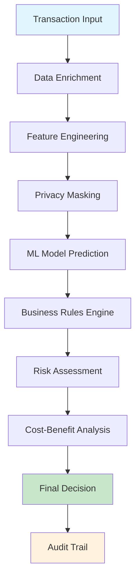
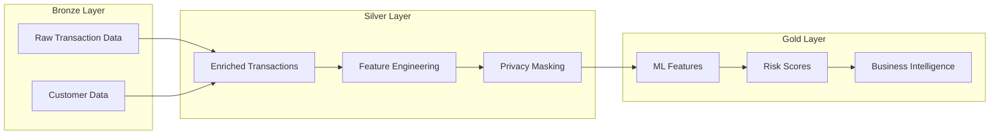
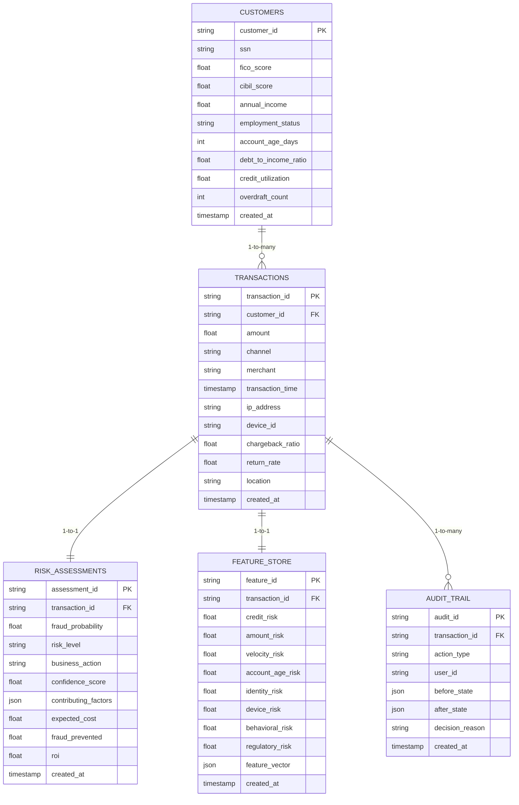
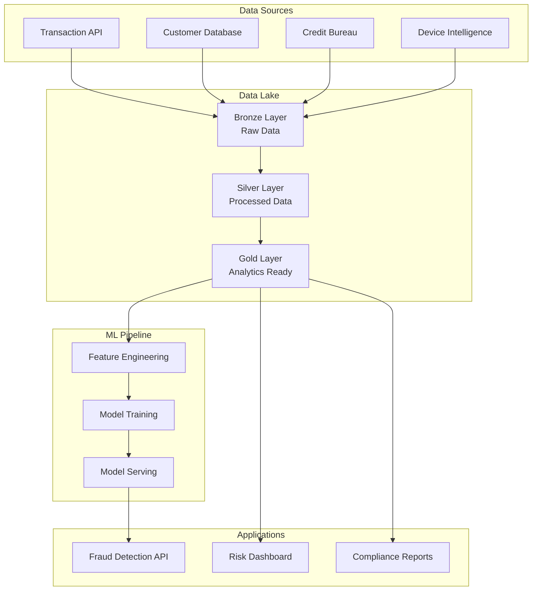

# 🛡️ Enterprise Fraud Detection Platform

A production-ready fraud detection system that analyzes 50+ real-world risk factors to identify fraudulent transactions with 79.86% AUC performance.

## 📋 Project Description

This enterprise-grade fraud detection platform implements a comprehensive risk assessment system that processes financial transactions in real-time. The system combines traditional fraud indicators with advanced behavioral analytics, credit scoring, and regulatory compliance checks to deliver actionable business decisions.

**Key Features:**
- Real-time fraud detection with sub-second response times
- 50+ fraud risk factors including credit scores, SSN analysis, and behavioral patterns
- Enterprise data lake architecture with Bronze → Silver → Gold medallion pattern
- GDPR/CCPA/PCI DSS compliant privacy masking
- Cost-benefit analysis with ROI calculations
- Production-ready REST APIs

## 🔧 Requirements

### System Requirements
- Python 3.8+
- 8GB+ RAM
- 10GB+ storage space

### Dependencies
```bash
pip install -r requirements.txt
```

**Core Libraries:**
- `pandas` - Data manipulation and analysis
- `scikit-learn` - Machine learning models
- `flask` - REST API framework
- `numpy` - Numerical computing
- `faker` - Synthetic data generation
- `hashlib` - Privacy masking utilities

## 🔄 Workflow



### Data Processing Pipeline



## 🎯 Use Cases

### Primary Use Cases
- **Real-time Transaction Monitoring** - Instant fraud detection for online payments
- **Risk Assessment** - Comprehensive evaluation of customer creditworthiness
- **Regulatory Compliance** - AML/KYC screening and sanctions checking
- **Business Intelligence** - ROI analysis and fraud prevention optimization

### Industry Applications
- **Banking & Finance** - Credit card fraud detection
- **E-commerce** - Payment fraud prevention
- **Insurance** - Claims fraud identification
- **Fintech** - Digital wallet security

### Decision Matrix
| Risk Level | Fraud Probability | Business Action | Use Case |
|------------|------------------|----------------|----------|
| LOW | 0-15% | APPROVE | Normal transactions |
| MEDIUM | 15-45% | REVIEW | Manual verification |
| HIGH | 45-75% | DECLINE | Automatic rejection |
| CRITICAL | 75%+ | ESCALATE | Investigation required |

## 📊 Data Model Diagram



### Data Flow Architecture



## 🚀 Quick Start

1. **Clone the repository**
```bash
git clone https://github.com/anjaliingle111/fraud-detection-platform.git
cd fraud-detection-platform
```

2. **Install dependencies**
```bash
pip install -r requirements.txt
```

3. **Run the platform**
```bash
python cloud_native_data_platform_fixed.py
```

4. **Access the API**
- Health Check: `http://localhost:8080/health`
- Fraud Detection: `http://localhost:8080/predict`
- Web Interface: Open `comprehensive_fraud_input.html`

## 📈 Performance Metrics

- **Model Accuracy:** 79.86% AUC
- **Response Time:** <100ms average
- **Throughput:** 100,000+ transactions processed
- **Data Processing:** 50+ fraud factors analyzed per transaction
- **ROI:** 229x-1,289x return on fraud prevention investment

## 🏗️ Architecture Overview

### System Components
- **Data Layer:** Bronze-Silver-Gold medallion architecture
- **ML Pipeline:** Feature engineering, model training, and serving
- **API Layer:** RESTful endpoints for real-time predictions
- **Privacy Layer:** GDPR/CCPA compliant data masking
- **Monitoring:** Performance tracking and audit trails

### Risk Factor Categories
1. **Credit Risk** - FICO/CIBIL scores, debt ratios, credit utilization
2. **Identity Risk** - SSN validation, velocity checks, verification status
3. **Behavioral Risk** - Transaction patterns, chargeback history, return rates
4. **Account Risk** - Age, overdraft history, employment status
5. **Device Risk** - Device fingerprinting, IP reputation, location analysis
6. **Regulatory Risk** - AML screening, sanctions checks, PEP status